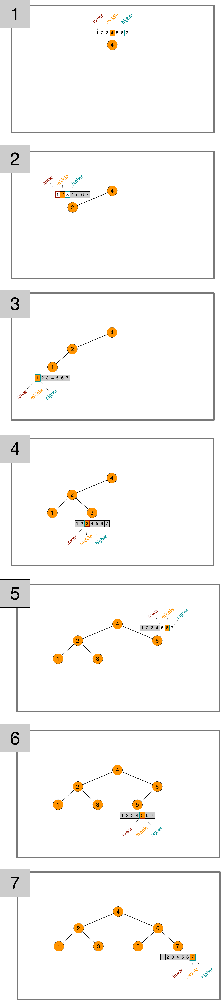
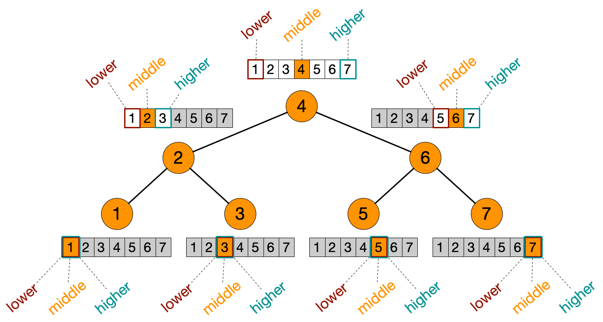

# Lista de Exercícios


## Identificação
**Professor**: Dr. Diego Pinheiro

**Disciplina**: Estrutura de Dados 1

**Atividade**: T06BinarySearchTree - P02FromArrayToBinarySearchTree

## Instruções 
> 1. Sua implementação deve estar dentro da pasta src/**main**/java 
> 2. Não modifique nenhum código dentro da pasta src/**test**/java).
> 3. A submissão **não deve ser feita após o prazo** (nem 1 minuto a mais)

## Descrição da Atividade

### Questão 01
Implemente um algoritmo `fromArrayToBinarySearchTree` para construir uma Árvore Binária de Busca a partir de um vetor de chaves `ordenado ascendentemente` e um vetor de valores. Ou seja, o método a seguir:

```java 
public static <Key extends Comparable<Key>, Value> BinarySearchTree<Key, Value> fromArrayToBinarySearchTree(Key[] keys, Value[] values)
```
constrói uma 
```java
BinarySearchTree<Key, Value>
```
a partir de um vetor `keys` de chaves do tipo `Key` 
```java
Key[] keys
```
e um vetor de valores do tipo `Value`
```java
Value[] values
```
> As chaves no vetor `keys` estão ordenadas ascendentemente. 

A figura a seguir apresenta o passo a passo do algoritmo `fromArrayToBinarySearchTree` para os vetores de chaves e valores 

```java
Integer[] keys = { 1, 2, 3, 4, 5, 6, 7 };

String[] values = { "One", "Two", "Three", "Four", "Five", "Six", "Seven" };

BinarySearchTree<Integer, String> tree = Utils.fromArrayToBinarySearchTree(keys, values);
```



A figura a seguir apresenta uma visão geral do algoritmo. 



> Uma dica é pensar na busca binária em um array ordenado de chaves. 

1. Inicializar `lo` igual à zero e `hi` igual à o tamanho do array menos 1;
2. Calcular o ponto médio `mid` entre `lo` e `hi`;
3. Criar um nó com a chave e o valor iguais às posições `mid` dos vetores de chaves e valores, respectivamente;
   1. Adicionar na subárvore à esquerda o nó obtido nos passos `2-3` considerando o intervalo inferior igual à `lo` e o superior igual à `mid - 1`;
   2. Adicionar na subárvore à direita o nó obtido nos passos `2-3` considerando o intervalo inferior igual à `mid + 1` e o superior igual à `hi`;
4. Ajustar o tamanho do nó;
5. Retornar o nó.

